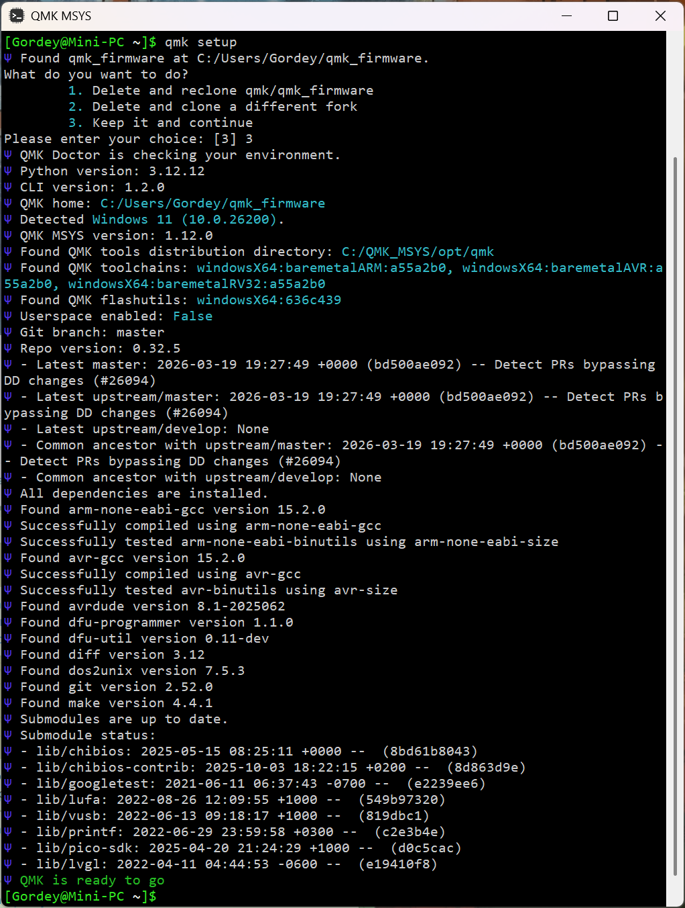
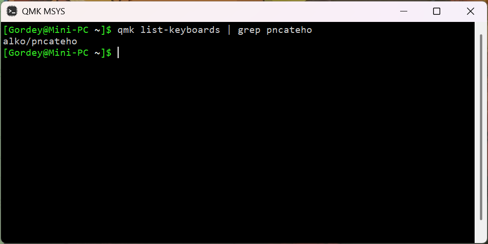

# PNCATEHO

Handwired fork PNCATEHO by aroum [https://github.com/aroum/PNCATEHO]


## Case

Thingiverse: https://www.thingiverse.com/thing:7178890

## QMK

1) Устанавливаем **QMK MSYS**: https://msys.qmk.fm/

2) Выполняем команду ```qmk setup```, находим ```QMK home``` и переходим в папку (копируем адрес или кликаем зажав ```ctrl```)



3) В папке keyboards/ создаём папку alko/, в неё копируем папку pncateho(из этого репозитория)
```
qmk_firmware/
└── keyboards/
    └── alko/
        └── pncateho/
            ├── ...
```
Проверяем, что qmk видит нашу прошивку, выполняя команду ```qmk list-keyboards | grep pncateho``` (выводим список клавиатур, оставляя только папки с названием pncateho)



Если название есть в консоли, значит qmk видит прошивку.

4) Комплируем прошику командой ```qmk compile -kb alko/pncateho -km default```. Итоговая прошивка лежит в папке qmk_firmware/.build/ под названием alko_pncateho_default.uf2

```
qmk_firmware/
|
└── 📂 .build/               
    │
    ├── 📁 obj_alko_pncateho_default/    # Объектные файлы
    │
    ├── alko_pncateho_default.tmp     # Временный файл (линковка)
    ├── alko_pncateho_default.elf     # ELF (отладочный)
    └── alko_pncateho_default.uf2     # ✅ Итоговая прошивка!
```

5) Записываем файл прошивки на rp2040. Подключаем плату к компьютеру с зажатой кнопкой Boot, она откроется как флешка RPI-RP2, копикуем туда файл прошивки alko_pncateho_default.uf2